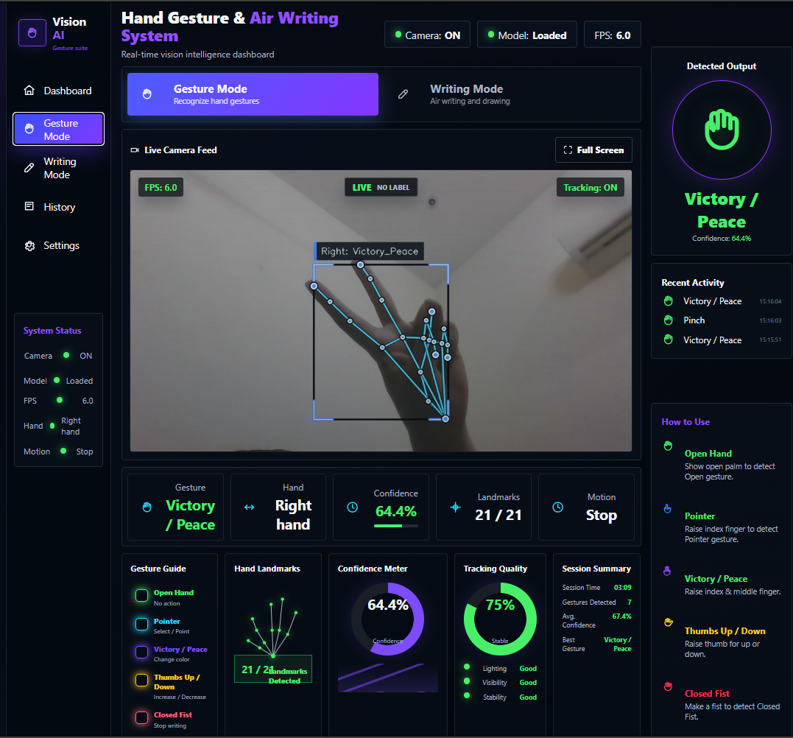
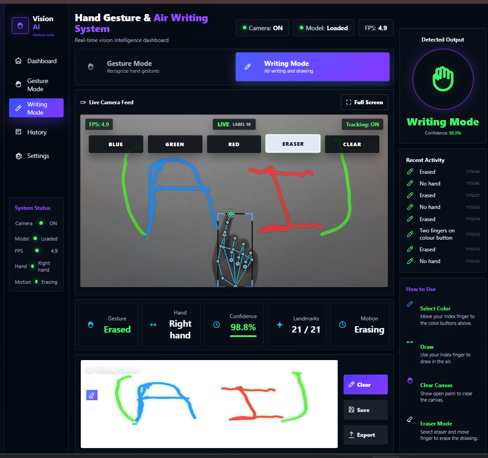
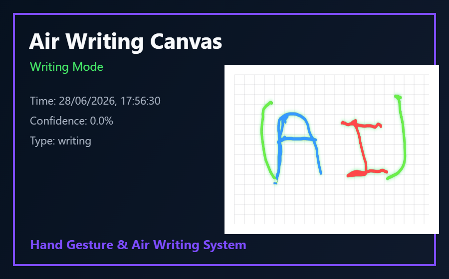
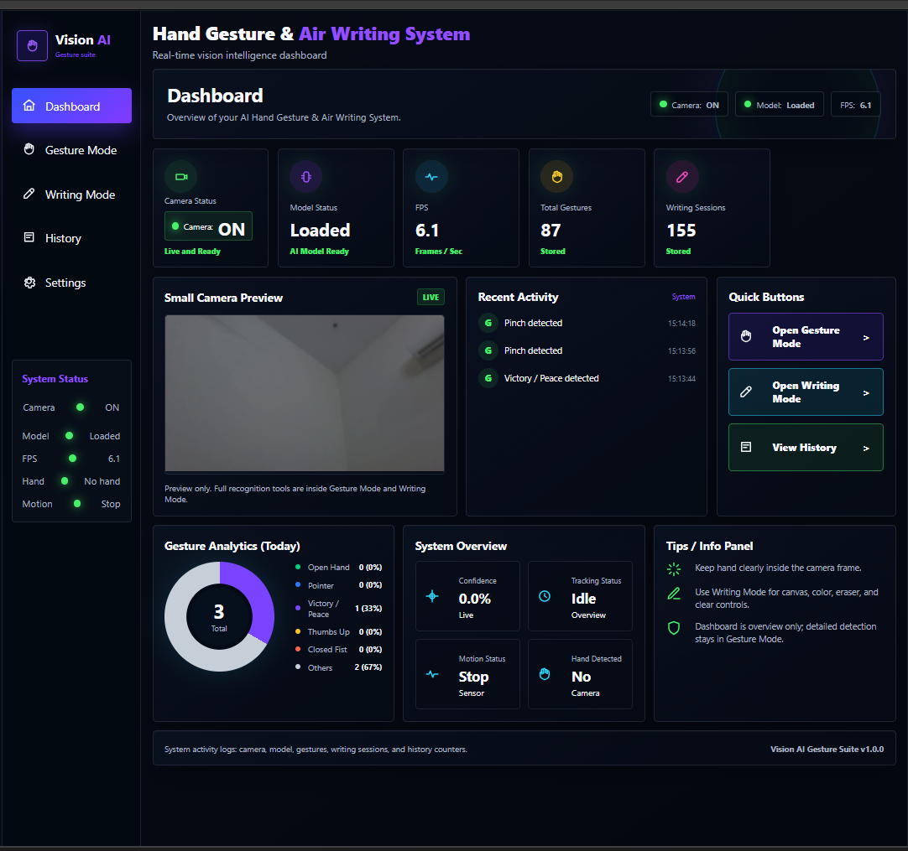

# ✋ Hand Gesture Recognition & Air Writing System

A real-time **Computer Vision and Machine Learning application** that recognizes hand gestures and enables users to write in the air using natural hand movements.

The system uses **MediaPipe** for real-time hand landmark tracking, **TensorFlow Lite** models for gesture classification, **OpenCV** for video processing, and **PyQt5** for the desktop air-writing interface.

The project demonstrates practical applications of **Human-Computer Interaction (HCI), Computer Vision, Machine Learning, and markerless hand tracking**.

---

## 🎥 Project Demo

### Real-Time Hand Gesture Recognition

<!-- Replace the path below with your actual screenshot -->


The application captures live webcam input, detects hand landmarks using MediaPipe, and recognizes gestures in real time using trained TensorFlow Lite classifier models.

---

### ✍️ Air Writing

<!-- Replace the path below with your actual screenshot -->


Air Writing allows the user to draw and write using hand movements without requiring a physical pen, touchscreen, or drawing tablet.

The hand is tracked through the webcam, and its movement is translated into digital strokes on the screen.

---

### 📝 Air Writing Canvas

<!-- Replace the path below with your actual screenshot -->


The writing canvas displays the strokes generated from the user's hand movements and provides an interactive environment for contact-free writing.

---

### 📊 Application Dashboard

<!-- Replace the path below with your actual screenshot -->


The application includes a graphical dashboard that provides access to the main gesture-recognition and air-writing functionality.

---

## ✨ Key Features

- Real-time hand detection and tracking
- Hand landmark extraction using MediaPipe
- Machine-learning-based gesture recognition
- TensorFlow Lite gesture classification
- Contact-free air writing
- Real-time webcam processing
- Interactive air-writing canvas
- PyQt5 desktop interface
- Browser-based UI mockup
- Custom keypoint classifier training and retraining
- Gesture history and application settings
- Unit testing support

---

## 🧠 How It Works

The system follows a real-time computer vision pipeline:

```text
Webcam Input
     ↓
Frame Processing with OpenCV
     ↓
Hand Detection & Landmark Tracking
     ↓
MediaPipe Hand Landmarks
     ↓
Keypoint / Motion Feature Processing
     ↓
TensorFlow Lite Classifier
     ↓
Gesture Prediction
     ↓
Gesture Recognition / Air Writing Output
```

### 1. Webcam Input

The application continuously captures video frames from the user's webcam using OpenCV.

### 2. Hand Landmark Detection

MediaPipe detects and tracks key landmarks of the user's hand in each frame.

These landmarks provide information about the positions of the fingers and hand.

### 3. Feature Processing

The detected landmark coordinates are processed into features that can be used by the gesture-classification model.

### 4. Gesture Classification

TensorFlow Lite classifier models process the extracted features and predict the corresponding hand gesture.

### 5. Air Writing

In Air Writing mode, tracked hand movements are converted into drawing strokes, allowing the user to write or draw in the air.

---

## 🛠️ Technologies Used

| Technology | Purpose |
|---|---|
| **Python** | Core application development |
| **OpenCV** | Webcam capture and real-time image processing |
| **MediaPipe** | Markerless hand detection and landmark tracking |
| **TensorFlow Lite** | Gesture classification models |
| **PyQt5** | Desktop air-writing interface |
| **NumPy** | Numerical and landmark data processing |
| **HTML/CSS/JavaScript** | Browser-based UI mockup |
| **unittest** | Application testing |

---

## 🤖 Machine Learning Components

The project uses trained classifier models for recognizing hand gestures from hand landmark data.

Two main TensorFlow Lite model components are included:

```text
model/keypoint_classifier/keypoint_classifier.tflite
model/keypoint_classifier/keypoint_classifier_label.csv

model/point_history_classifier/point_history_classifier.tflite
model/point_history_classifier/point_history_classifier_label.csv
```

### Keypoint Classifier

The keypoint classifier uses hand landmark information to identify hand poses and gestures.

### Point History Classifier

The point-history classifier uses movement history to help recognize gestures that depend on hand motion over time.

The repository also contains training data and a retraining script so that the keypoint classifier can be retrained or extended.

---

## 📂 Project Structure

```text
.
├── main.py
├── pyqt_writing_ui.py
├── retrain_keypoint_classifier.py
├── requirements.txt
├── ui_mockup.html
├── model/
├── utils/
├── tests/
└── screenshots/
```

### Important Files

- `main.py` — Main real-time gesture-recognition application
- `pyqt_writing_ui.py` — PyQt-based air-writing interface
- `retrain_keypoint_classifier.py` — Script for retraining the keypoint classifier
- `requirements.txt` — Required Python dependencies
- `ui_mockup.html` — Browser-based interface mockup
- `model/` — Gesture-classification models, labels, and training-related files
- `utils/` — Supporting utility functions
- `tests/` — Unit tests
- `screenshots/` — Project screenshots

---

## ⚙️ Requirements

- Python 3.10
- Webcam
- Windows, Linux, or macOS

---

## 🚀 Installation

### 1. Clone the Repository

```bash
git clone <YOUR-REPOSITORY-URL>
cd <YOUR-REPOSITORY-NAME>
```

Replace `<YOUR-REPOSITORY-URL>` and `<YOUR-REPOSITORY-NAME>` with your actual GitHub repository information.

### 2. Create a Virtual Environment

```powershell
python -m venv .venv
```

This creates an isolated Python environment for the project.

### 3. Activate the Virtual Environment

On Windows:

```powershell
.\.venv\Scripts\activate
```

On macOS/Linux:

```bash
source .venv/bin/activate
```

This activates the project's isolated Python environment.

### 4. Install Dependencies

```powershell
pip install -r requirements.txt
```

This installs the libraries required to run the application.

---

## ▶️ Running the Application

### Run Gesture Recognition

```powershell
python main.py
```

This starts the main real-time hand gesture recognition application.

### Run the Air Writing Interface

```powershell
python pyqt_writing_ui.py
```

This launches the PyQt air-writing interface.

---

## 📷 Camera Configuration

To use a different camera device:

```powershell
python main.py --device 1
```

`--device 1` selects another available camera instead of the default camera.

To specify the camera resolution:

```powershell
python main.py --width 960 --height 540
```

This runs the camera feed at a resolution of `960 × 540`.

---

## 🧪 Testing

Run the included unit tests with:

```powershell
python -m unittest discover tests
```

This automatically discovers and executes tests stored inside the `tests/` directory.

---

## 🔄 Model Retraining

The repository includes:

```text
retrain_keypoint_classifier.py
```

This script supports retraining the keypoint classifier using the training data available in the project.

This makes it possible to experiment with additional hand gestures and update the classifier as the system evolves.

---

## 🎯 Applications

This type of markerless gesture-recognition system can be explored for applications such as:

- Touch-free human-computer interaction
- Gesture-controlled interfaces
- Air writing
- Accessibility interfaces
- Interactive learning systems
- Contact-free control systems
- Real-time movement-based applications

---

## 🔮 Future Improvements

Possible extensions of the project include:

- Adding more gesture classes
- Improving gesture-classification accuracy
- Supporting two-hand gestures
- Improving air-writing stroke stabilization
- Adding character or handwriting recognition
- Exploring deep-learning-based gesture models
- Extending gesture control to other applications
- Improving real-time performance and latency

---

## 📝 GitHub Notes

Virtual environments, cache files, generated outputs, and backup files should not be committed to the repository.

The `.gitignore` file excludes files such as:

```text
.venv/
myenv/
.idea/
__pycache__/
output/
*.pyc
*.bak_*
```

---

## 👩‍💻 Author

**Asima Ashraf**

BS Computer Science Student  
University of Engineering and Technology (UET), Lahore

Interests: **Artificial Intelligence, Machine Learning, Computer Vision, Software Engineering, and Intelligent Systems**
